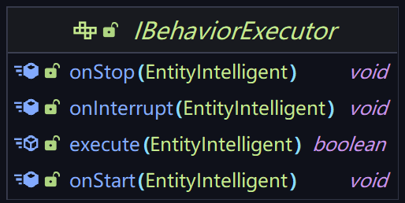
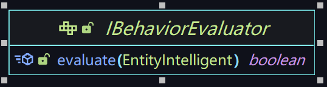

# 第一章 AI框架概述

_**author: daoge_cmd**_

## 1.0 导言

生物是MC的重要组成部分

然而，从古至今，生物特性缺失问题一直是NK系（乃至第三方）服务端的硬伤。

当然，我们很高兴看到了一些成功的解决方案，例如第三方插件[MobPlugin](https://github.com/Nukkit-coders/MobPlugin)。

很遗憾，类似的插件尽管能弥补NK系服务端没有生物的遗憾，其运行效果却令人一言难尽。

混乱的架构设计+特性的大量缺失+差强人意的刷怪逻辑使我们不得不抛弃 [NukkitPetteriM1Edition](https://github.com/PetteriM1/NukkitPetteriM1Edition) 的做法（内置MobPlugin）

我们选择自行设计架构。尽管[过程很艰难](https://www.minebbs.com/threads/powernukkitx-ai-2022-7-29.13358/)（3次推翻重写+无数次测试和优化），但是我们最终做到了。

PNX的生物AI框架无论在性能，效果，易用性上都完全超过了社区其他实现

"我们相信，这次推出的实体AI框架结合稍早前推出的自定义实体API将会助力各位插件开发者更好地实现自己的创想，让RPG、探索类等服务器类型达到新的高度" - SuperIce666

在接下来的内容中，我们使用“框架”代指PNX的AI框架

框架设计过程中，我们借鉴了JE原版的Memory，Activity，Behavior设计，同时融合了BE原版的模块化（组件化）思路以及实现了完全的异步+并行。

我们将以“羊”这个生物作为例子，简述生物的每个特性是如何在框架中实现的

### 1.1.0 通过单个行为的组合实现生物的复杂逻辑

不难想到，一只完整的羊拥有以下行为：

- 看向最近玩家
- 随机漫游
- 受到伤害时逃跑
- 跑向手里拿着小麦的玩家
- 吃草
- 交配

这些行为相互独立，我们称每个独立的行为为一个```Behavior```。这样，羊的复杂逻辑就这样被我们抽象成一个一个```Behavior```了

### 1.1.1 行为评估器与执行器

当然，只有```Behavior```显然不够。我们注意到，在羊的整个生命周期中，并不是所有行为都在运行。意识到这一点后，我们将```Behavior```继续细分成```BehaviorExecutor```（行为执行器）和```BehaviorEvaluator```（行为评估器），其中```BehaviorExecutor```包含了此行为被激活时具体要做的事情，```BehaviorEvaluator```则包含了决定此行为是否应该被激活的逻辑。

我们需要特别注意的是评估器与执行器的关系。来到源码，两者的接口描述如下：




若行为处于非激活状态，评估器的```evaluate```方法将每gt(可调)被调用一次。

当```evaluate```方法返回```true```时，代表此次评估成功，执行器的```execute```方法将会被每gt(可调)调用一次，直到```execute```方法返回```false```

注意，当行为处于激活状态时，其评估器将不会再被调用。换言之，处于激活状态的行为何时停止由执行器决定或被更高优先级行为覆盖（详见下段）。

当行为执行器由于返回```false```而主动停止激活，其```onStop```方法将会被调用，然而如果是被更高优先级行为覆盖导致的中断，则会调用其```onInterrupt```方法而不是```onStop```。

### 1.1.2 行为优先级

行为自身不仅存在执行条件，事实上行为之间也存在相互制约的关系。例如当羊发现范围内存在手里拿着小麦的玩家，其处于激活状态的```随机漫游```行为就应该停止运行。我们将行为之间的这种关系称之为优先级覆盖原则，即每个行为都具有一个特定的优先级。当有高优先级的行为被激活时，正在运行的低优先级的行为就应该被中断；对于优先级相同的两个行为，他们可以同时处在激活状态

我们将羊的行为按照优先级顺序由高到低重新排列：

- 4 受到伤害时逃跑 
- 3 交配 
- 2 跑向手里拿着小麦的玩家 
- 1 吃草 
- 0 看向最近玩家 & 随机漫游 


